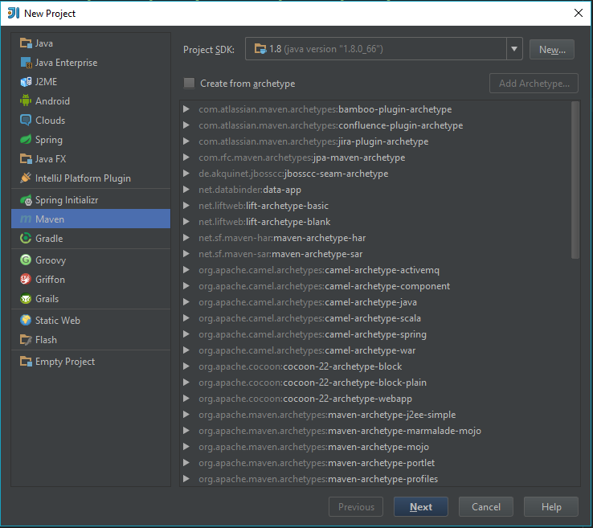
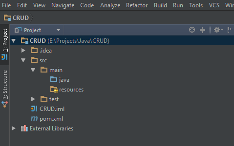

.. _createproject:

Создание проекта
==================

Для начала нам понадобится установленная `Java (JDK) <http://www.oracle.com/technetwork/java/javase/downloads/jdk8-downloads-2133151.html>`_,
а также среда разработки. Мы советуем использовать `IntelliJ IDEA <https://www.jetbrains.com/idea/download/#section=windows>`_.

Запускаем IntelliJ IDEA и создаем новый проект. В окне выбора типа проекта указываем Maven.

	   
На следующей странице в поле **GroupId** вводим название фирмы (группы), а также артефакт проекта в поле **ArtifactId**.

Далее вводим название проекта и место расположения на диске. После этого откроется окно проекта. Структура проекта будет выглядеть примерно так: 

	   
Теперь добавим поддержку Spring:

	:menuselection:`Правой клавишей мыши по корню проекта --> ...Add Framework Support`
	
В Появившеся окне выбираем :menuselection:`Spring --> Spring MVC`. Указываем метку **Download** и жмем ОК.

Теперь в папке Java создадим пакет ``com.scrud.controllers``, в котором создадим класс ``HelloController``:

.. code-block:: java
	:linenos:
	
	package com.scrud.controllers;

		mport org.springframework.stereotype.Controller;
		mport org.springframework.ui.ModelMap;
		mport org.springframework.web.bind.annotation.RequestMapping;
		mport org.springframework.web.bind.annotation.RequestMethod;
		
		@Controller
		ublic class HelloController {
		
		
			@RequestMapping(value = "/", method = RequestMethod.GET)
			public String printWelcome(ModelMap model) {
				return "index";
		
			}
		
			@RequestMapping(value = "/about", method = RequestMethod.GET)
			public String printJpa(ModelMap model) {
		
				return "about";
		
			}
		
	}
	
После этого в папке Java создадим пакет ``com.scrud.config``, в нём создадим класс ``AppInit``:

.. code-block:: java
	:linenos:

	package com.scrud.config;
	
	import org.springframework.web.servlet.support.AbstractAnnotationConfigDispatcherServletInitializer;
	
	public class AppInit extends AbstractAnnotationConfigDispatcherServletInitializer {
		// Этот метод должен содержать конфигурации которые инициализируют Beans
		// для инициализации бинов у нас использовалась аннотация @Bean
		@Override
		protected Class<?>[] getRootConfigClasses() {
			return new Class<?>[]{
					WebConfig.class
			};
		}
	
		// Тут добавляем конфигурацию, в которой инициализируем ViewResolver
		@Override
		protected Class<?>[] getServletConfigClasses() {
	
			return new Class<?>[]{
					WebConfig.class
			};
		}
	
		@Override
		protected String[] getServletMappings() {
			return new String[]{"/"};
		}
	
	}