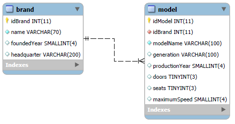
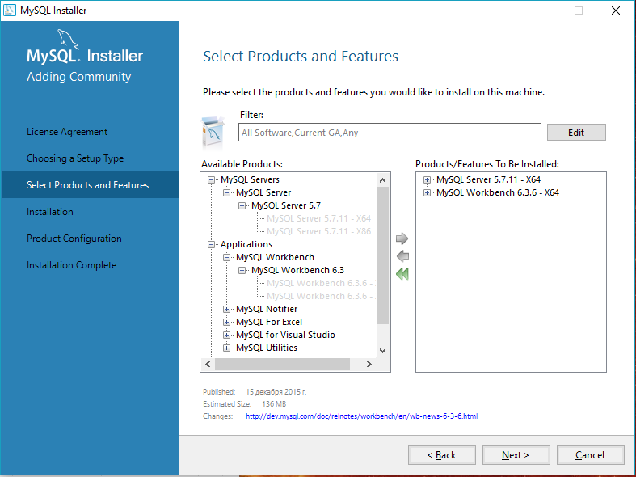

.. _mysqlinst:

База данных MySQL
==================

Для системы ввода, вывода и редактирования информации необходимо где-то эту информацию хранить.
Поэтому мы создадим базу данных. (В нашем случае мы используем MySQL)

Проектирование базы данных
--------------------------

Наш сайт будет работать со списком автомобилей. 
Для начала смоделируем базу, состоящую из двух таблиц: ``brand`` и ``models``.

Таблица ``brand`` будет содержать:

* уникальный id марки
* имя марки
* год основания
* место расположения штаб-квардиры

Таблица ``models``, к примеру, будет содержать:

* уникальный id модели
* id бренда, к которому относится
* имя модели
* поколение модели
* год производства
* количество дверей
* количество сидений
* максимальная скорость

Диаграмма предложенной модели базы будет выглядеть так:

Установка MySQL сервера
-----------------------

В данном руководстве мы предлагаем осуществить установку вместе с WorkBench 
для быстрого и удобного доступа к данным и их редактирования.

Для этого перейдем по `ссылке <https://dev.mysql.com/downloads/workbench/>`_ 
и скачаем подходящий под вашу систему дестрибутив.

Во время установки подтверждаем лицезию. Далее выбираем режим установки Custom и жмем далее.
На следующем окне отмечаем **MySQL Server** и **MySQL WorkBench** для своей разрядности системы.

	
Затем выбираем папку установки отдельно для **Server** и для **WorkBench**, подтверждаем начало скачивания.
После удачной установки обех программ необходимо настроить сервер.

На первом  окне оставляем всё по умолчанию.

:Проверьте: В поле Config Type должно быть выбрано ``Development Machine``.

На следующем этапе вводим пароль. В нашем проекте используется пароль ``0000``.

.. attention:: Если вы устанавливаете свой пароль, отличный от нашего, то в дальнейшем придется 
				отредактировать конфигурацию Java сервера, указав ваш пароль.
	
Дальше подтверждаем установки по умолчанию.

После успешного завершения конфигурации сервера нажимаем "Finish".

Создание базы данных
---------------------

После запуска WorkBench подключаемся к созданному серверу баз данных, 
кликнув по прямоугольнику на главной странице.

Теперь нам нужно **создать новую базу**. Для этого в открывшемся окне вводим и выполняем запрос:

.. code-block:: sql
	:linenos:
	
	CREATE DATABASE IF NOT EXISTS `cars_db` DEFAULT CHARACTER SET utf8 COLLATE utf8_general_ci;
	USE `cars_db`;

Добавление таблиц
~~~~~~~~~~~~~~~~~

Выше мы упомянули о том, что нам необходимо 2 таблицы с определёнными полями. Давайте создадим их,
выполнив в поле ввода такой SQL запрос:

.. code-block:: sql
	:linenos:
	
	CREATE TABLE brand(
		idBrand INT NOT NULL AUTO_INCREMENT,
		name VARCHAR(70) NOT NULL,
		foundedYear SMALLINT(4),
		headquarter VARCHAR(200),
		PRIMARY KEY (idBrand)
	);

	CREATE TABLE  model(
		idModel INT NOT NULL AUTO_INCREMENT,
		idBrand INT NOT NULL,
		modelName VARCHAR(100) NOT NULL,
		generation VARCHAR(100),
		productionYear SMALLINT(4),
		doors TINYINT(3),
		seats TINYINT(3),
		maximumSpeed SMALLINT(4),
		PRIMARY KEY (idModel),
		FOREIGN KEY (idBrand) REFERENCES brand(idBrand) ON DELETE CASCADE
	);

Наполнение базы
~~~~~~~~~~~~~~~~

В принципе, в таком состоянии база готова для дальнейшей работы, но для наглядности предлагаем наполнить её некоторыми данными.
Для этого выполним такой запрос:

.. code-block:: sql
	:linenos:
	
	INSERT INTO brand (name,foundedYear,headquarter)
	VALUES ("Volkswagen",1946,"Wolfsburg, Germany");
	INSERT INTO brand (name,foundedYear,headquarter)
	VALUES ("Audi",1910,"Ingolstadt, Germany");
	INSERT INTO brand (name,foundedYear,headquarter)
	VALUES ("Fiat",1902,"Turin, Italy");
	INSERT INTO brand (name,foundedYear,headquarter)
	VALUES ("Opel",1862,"Rüsselsheim, Hesse, Germany");
	INSERT INTO brand (name,foundedYear,headquarter)
	VALUES ("Nissan Motor Co.",1933,"Nishi-ku, Yokohama, Japan");
	INSERT INTO brand (name,foundedYear,headquarter)
	VALUES ("Tesla Motors",2003,"Palo Alto, California, U.S.");
	INSERT INTO brand (name,foundedYear,headquarter)
	VALUES ("Škoda Auto",1895,"Mladá Boleslav, Czech Republic");
	INSERT INTO brand (name,foundedYear,headquarter)
	VALUES ("Subaru",1953,"Ebisu, Tokyo, Japan");
	
	INSERT INTO model (idBrand,modelName,generation, productionYear, doors, seats, maximumSpeed)
	VALUES (1,"Passat","Passat Alltrack (B8)", 2015 ,5 ,5 ,220);
	INSERT INTO model (idBrand,modelName,generation, productionYear, doors, seats, maximumSpeed)
	VALUES (1,"Touran","	Touran II", 2015 ,5 ,7 ,206);
	INSERT INTO model (idBrand,modelName,generation, productionYear, doors, seats, maximumSpeed)
	VALUES (2,"A4","A4 allroad (B9)", 2016 ,5 ,5 ,231);
	INSERT INTO model (idBrand,modelName,generation, productionYear, doors, seats, maximumSpeed)
	VALUES (3,"124","124 Spider (2016)",2016 ,2 , 3, 205);
	INSERT INTO model (idBrand,modelName,generation, productionYear, doors, seats, maximumSpeed)
	VALUES (4,"Meriva B (facelift 2014)","-",2014 ,5 , 5, 198);
	INSERT INTO model (idBrand,modelName,generation, productionYear, doors, seats, maximumSpeed)
	VALUES (4,"Speedster","-",2003 ,2 , 2, 225);
	INSERT INTO model (idBrand,modelName,generation, productionYear, doors, seats, maximumSpeed)
	VALUES (5,"Bluebird Sylphy","-",2000 ,4 , 5, 201);
	INSERT INTO model (idBrand,modelName,generation, productionYear, doors, seats, maximumSpeed)
	VALUES (5,"Bluebird (U14)","14",1998 ,4 , 5, 200);

На этом этап создания базы данных окончен.